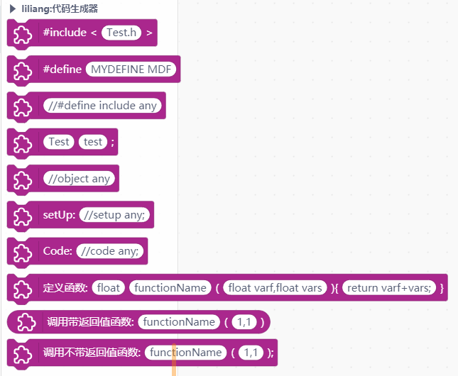
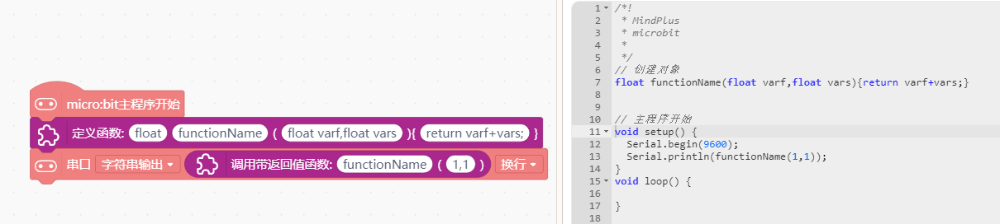

# CodeBlock 代码生成器


---------------------------------------------------------


## 链接
- **本用户库加载地址:** ```https://github.com/liliang9693/ext-codeBlock```
- **Mind+下载地址：** [http://mindplus.cc](http://mindplus.cc "http://mindplus.cc")    
- **Mind+扩展库教程：** [https://mindplus.dfrobot.com.cn/extensions-user](https://mindplus.dfrobot.com.cn/extensions-user "https://mindplus.dfrobot.com.cn/extensions-user")    

## 简介

- **介绍：** 本扩展库实现在图形模块上输入代码，实现图形化积木与代码混合编写的目的，方便在没有图形积木时直接调用代码。  

## Blocks



## 示例



## License

MIT

## 硬件支持

MCU                | JavaScript    | Arduino   | MicroPython    | Remarks
------------------ | :----------: | :----------: | :---------: | -----
micro:bit        |             |       √       |             | 
mpython        |             |        √      |             | 
arduino uno    |             |        √      |             | 
 

## 更新日志
- V0.0.1  第一版发布
- V0.0.2  增加圆形任意code积木，支持新的几块板子
- V0.0.3  优化生成代码增加id，支持新的几块板子


